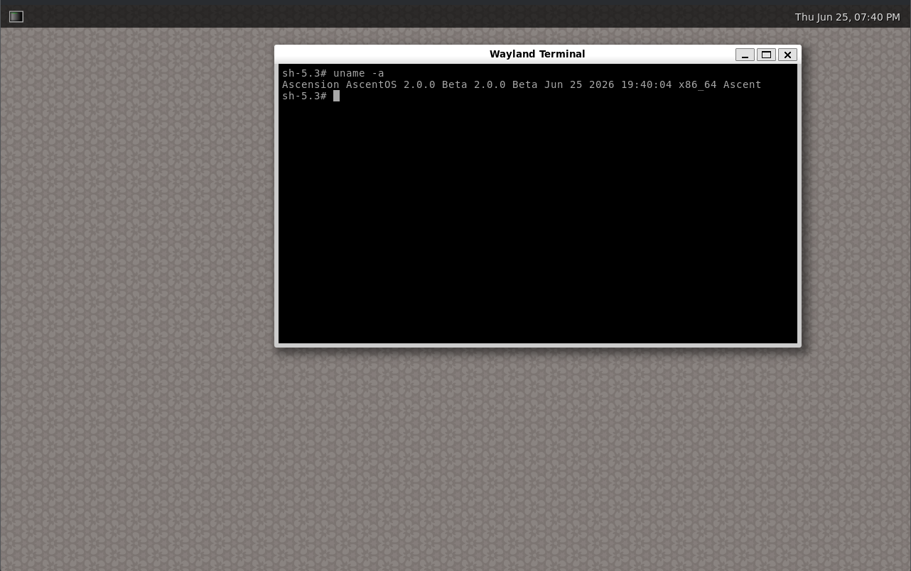
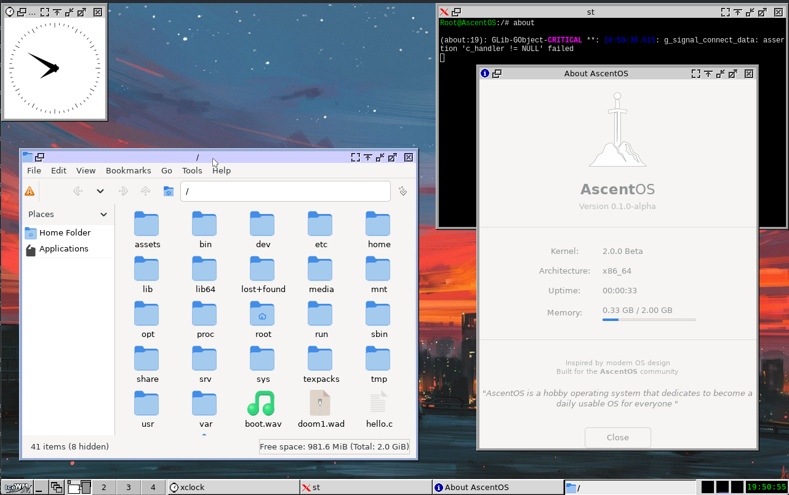

# AvoryOS




AvoryOS is a hobby operating system kernel for the x86_64 architecture, written in C and Assembly. It can run Linux programs. (I know it's not so special.)

## My Goal

Making this a daily-drivable operating system. (I know I'm probably not going to use it anyway lol.)

## Prerequisites

To build the project on Linux, you'll need:

* `make`, `gcc`/`clang`, `nasm`
* `git`, `curl`
* `xorriso` (for ISO creation)
* `qemu-system-x86_64` (for emulation)
* `e2fsprogs` (`mkfs.ext3` and `debugfs` are required for disk image generation)
* `rustc` & `cargo`

## Building and Running

1. **Build everything:**

   ```bash
   make
   ```

This prepares the musl-based cross-toolchain, builds the kernel, and generates the bootable ISO.

> **Important:** You also need to build the ported software.

## Building Ported Software

To build the full suite of ported tools (Bash, X11, etc.), run these scripts in order:

```bash
./scripts/build-bash.sh      && \
./scripts/build-coreutils.sh && \
./scripts/build-tcc.sh       && \
./scripts/setup-alpine.sh       && \
./scripts/build-tinygl.sh
```

---

Developed as an open-source project for fun and learning. Some people might call it AI slop, but I don't think so.
